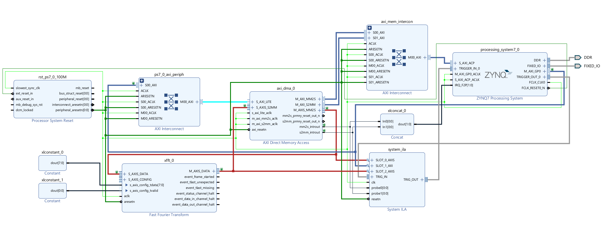
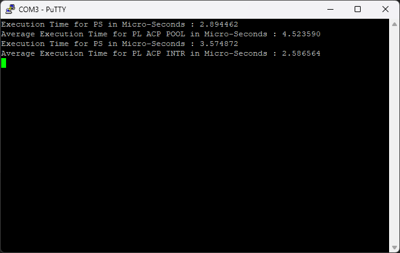

# FFT Hardware Acceleration on Xilinx Zynq using AXI DMA + ACP

Hardware-accelerated Fast Fourier Transform (FFT) implementation on **Xilinx Zynq-7000 SoC** using **AXI DMA through the ACP port**, comparing software execution on the Processing System (PS) with hardware acceleration in Programmable Logic (PL).

---

## Project Overview

This project benchmarks an **8-point FFT** implemented in two ways:

### Processing System (PS)

* ARM Cortex-A9 executes FFT in C
* Input reordering and butterfly stages
* Runtime measured with `XTime`

### Programmable Logic (PL)

* Xilinx FFT IP Core
* AXI DMA data movement
* ACP coherent memory access
* Tested in **Polling** and **Interrupt** modes

---

## Hardware Block Design



Main IP blocks:

* Zynq Processing System
* AXI DMA
* FFT IP Core
* AXI Interconnect
* Processor System Reset
* System ILA

---

## Performance Results



| Method           | Average Execution Time |
| ---------------- | ---------------------- |
| PS FFT           | 2.89 µs                |
| PL ACP Polling   | 4.52 µs                |
| PL ACP Interrupt | 2.58 µs                |

**Observation:** For this small FFT size, interrupt-driven DMA reduced software overhead and performed best in the measured runs.

---

## Source Code

```text
src/fft_dma_benchmark.c
```

Key functions:

* `InputReorder()`
* `FFTStages()`
* `FFTPSvsACP_poll()`
* `FFTPSvsACP_intr()`
* `SetupIntrSystem()`

---

## Repository Structure

```text
fft_int_dma_acp/
├── hardware/
├── images/
│   ├── block_design.png
│   └── uart_output.png
├── src/
│   └── fft_dma_benchmark.c
└── README.md
```

---

## Skills Demonstrated

* FPGA design in Vivado
* AXI DMA integration
* ACP coherent transfers
* Embedded C on Zynq
* Interrupt handling with GIC
* HW/SW co-design
* Performance benchmarking

---

## Future Improvements

* Larger FFT sizes (64 / 256 / 1024)
* Scatter-gather DMA mode
* Fixed-point FFT comparison
* Streaming ADC input pipeline

---

## Author

**Saeed Omidvari**
